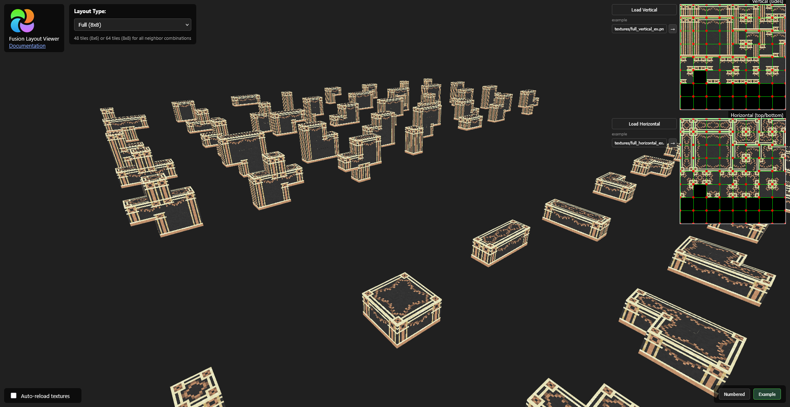
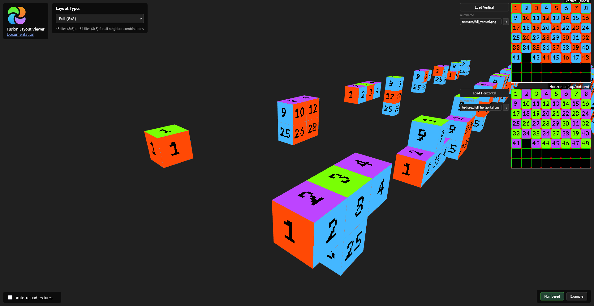
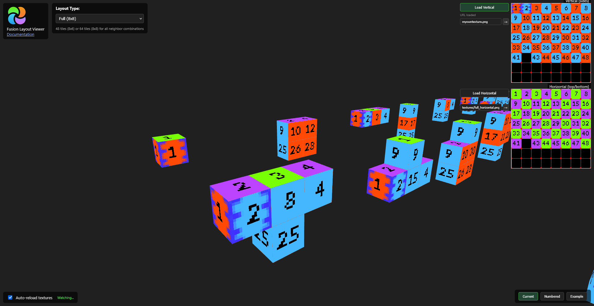

# Fusion Layouts Viewer (Full, Simple, Compact, Horizontal, Vertical)

> This project is independent and is not affiliated with SuperMartijn642 or the Fusion project.

A 3D visualizer for [Fusion](https://github.com/SuperMartijn642/Fusion) connected textures in Minecraft. Preview how your texture will look when applied to blocks with various neighbor configurations.

## Preview





## Getting Started

### Start the server
```sh
node serve.js
```
Then open `http://localhost:8080` in your browser.

> **Note:** You must serve the files (not just open `index.html` directly) to avoid CORS issues with texture loading.

## Controls

- **Left-click + drag**: Rotate the camera
- **Right-click + drag**: Pan the camera
- **Scroll wheel**: Zoom in/out
- **Shift + Left-click + drag**: Lateral movement
- **Layout selector**: Switch between Full, Simple, Compact, Horizontal, and Vertical layouts

## Texture Input

### Option 1: File Upload
Click the **"Upload Vertical/Horizontal"** buttons to load textures from your computer.

> **Note:** Hotreloading from file uploads is not supported.

### Option 2: URL Loading
Enter a URL in the text field and click **"Load"**. You can use:
- Full URLs: `http://localhost:8080/textures/my_texture.png`
- Just filenames: `my_texture.png` (auto-prefixed with `http://localhost:8080/textures/`)

### Texture Presets
- **Current**: Saves and restores your custom texture URLs per layout
- **Numbered**: Debug textures with tile numbers visible
- **Example**: Sample connected textures

## Auto-Reload

Enable **"Auto-reload textures"** to automatically refresh textures when they change on disk. This is useful when editing textures in an image editor.

Classic workflow:

1. Place your textures in the `textures/` folder
2. Enter the filename in the URL field (e.g., `my_texture.png`)
3. Click "Load" to load the texture
4. Enable auto-reload
5. Edit and save your texture file — the viewer updates automatically!

## Texture Formats

| Layout | Texture Size | Description |
|--------|-------------|-------------|
| Full | 8x8 or 8x6 tiles | All 64 neighbor combinations (with diagonals) |
| Simple | 4x4 tiles | 16 combinations (no diagonals) |
| Compact | 5x1 tiles | Reduced patterns with borders |
| Horizontal | 4x1 tiles | Left/right connections only |
| Vertical | 1x4 tiles | Top/bottom connections only |

For Full and Simple layouts, you can use **two textures**:
- **Vertical**: Used for side faces (north, south, east, west)
- **Horizontal**: Used for top/bottom faces (usually named with `_top` suffix)

For Horizontal, and Vertical, a **single texture** is used for all faces.

## More Info

See the [Fusion Wiki - Texture Types](https://github.com/SuperMartijn642/Fusion/wiki/Texture-Types) for detailed documentation on creating connected textures.

## Donations

If you find this tool useful, and want to donate, consider supporting Fusion project, or other open-source projects you use.
There is some of them:

- [Fusion](https://www.curseforge.com/minecraft/mc-mods/fusion-connected-textures)
- [Dawn Of Time](https://www.curseforge.com/minecraft/mc-mods/dawn-of-time)
- ???

## License
WTFPL